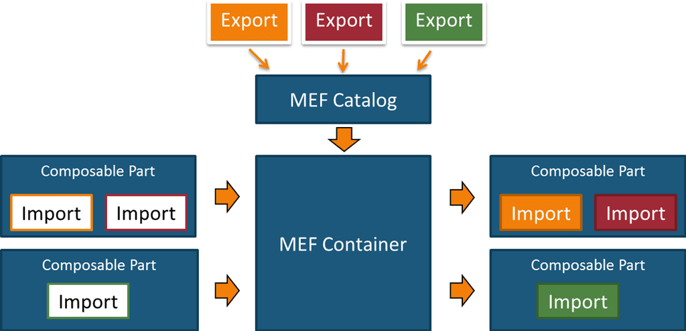

## 什么是 MEF？

Managed Extensibility Framework (MEF) 是用于创建可扩展的轻量级应用程序的库。  它让应用程序开发人员得以发现和使用扩展且无需配置。 它还让扩展开发人员得以轻松地封装代码并避免脆弱的紧密依赖性。 MEF  让扩展不仅可在应用程序内重复使用，还可以跨程序重复使用。


## MEF原理




**项目示例：**

```shell
$  tree ./Mef.Demo -L 1
./Mef.Demo
├── App
├── Mef.Contracts					【协议】定义了所有业务服务
├── Mef.Export.DB.Mysql				【导出】组件/插件,实现了Contracts协议
├── Mef.Export.DB.SqlServer		    【导出】组件/插件,实现了Contracts协议
├── Mef.Export.Payment				【导出】组件/插件,实现了Contracts协议
├── Mef.Import						【导入】集成组件,相当于组装车间
├── Mef.Demo.sln
└── README.md
```


```c#
using System.ComponentModel.Composition;
using System.ComponentModel.Composition.Hosting;
using System.Reflection;
using Mef.Contracts;

namespace Mef.Import;


/// <summary>
/// MEF Service Factory
/// </summary>
public class ServiceFac
{
    //导出所有协议
    [Import(typeof(IPayment))] public IPayment? Payment { get; set; }
    [ImportMany(typeof(IRepository))] public IEnumerable<IRepository>? Repositories { get; set; }

    public ServiceFac()
    {
        // 【Hosting】聚合目录,一个聚合目录可以承载N个ComposablePartDefinition
        var aggCat = new AggregateCatalog();

        // 获取当前目录的程序集
        var dir = Path.GetDirectoryName(Assembly.GetExecutingAssembly().Location);
        if (dir == null) throw new ApplicationException();

        //【Hosting】文件目录
        using var dirCat = new DirectoryCatalog(dir);
        
        //【Hosting】复合容器
        using var container = new CompositionContainer(aggCat);
        aggCat.Catalogs.Add(dirCat);
        container.ComposeParts(this); //组合/组装部件
    }
}
```


## 运行项目

```shell
$ cd Mef.Demo/
$ dotnet build
$ dotnet run --project ./App/App.csproj 
==> 支付处理成功
==> Mysql连接成功
==> SqlServer连接成功
```


## 参考链接

> https://learn.microsoft.com/zh-cn/dotnet/framework/mef


